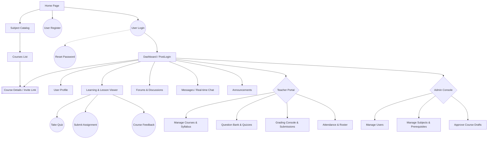
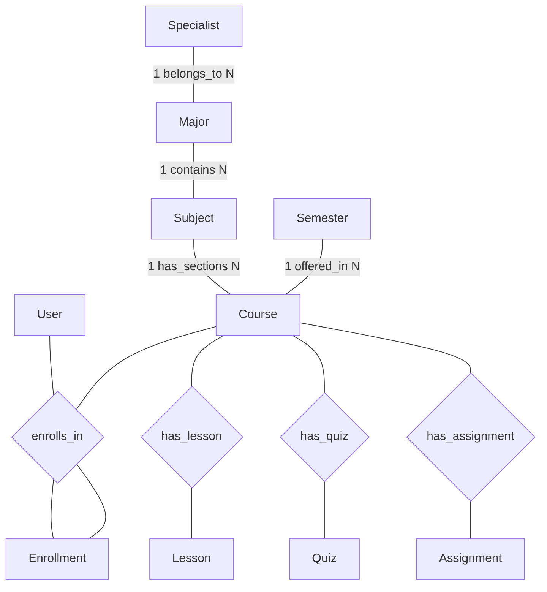
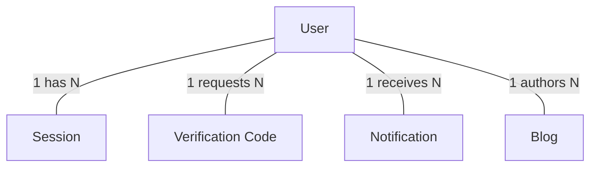
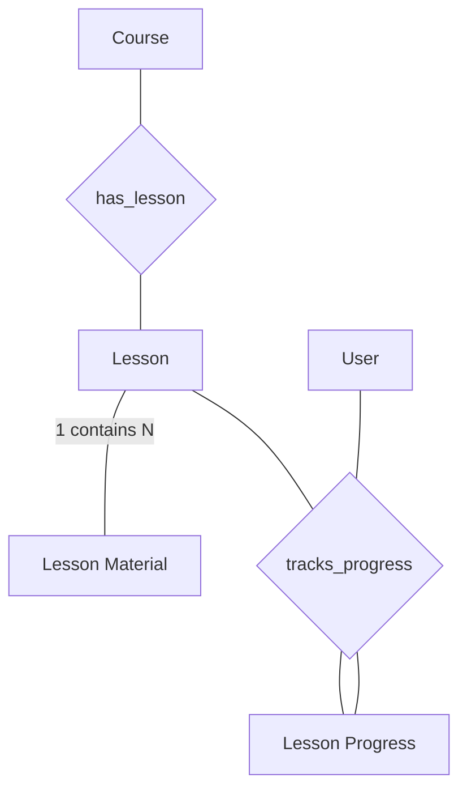
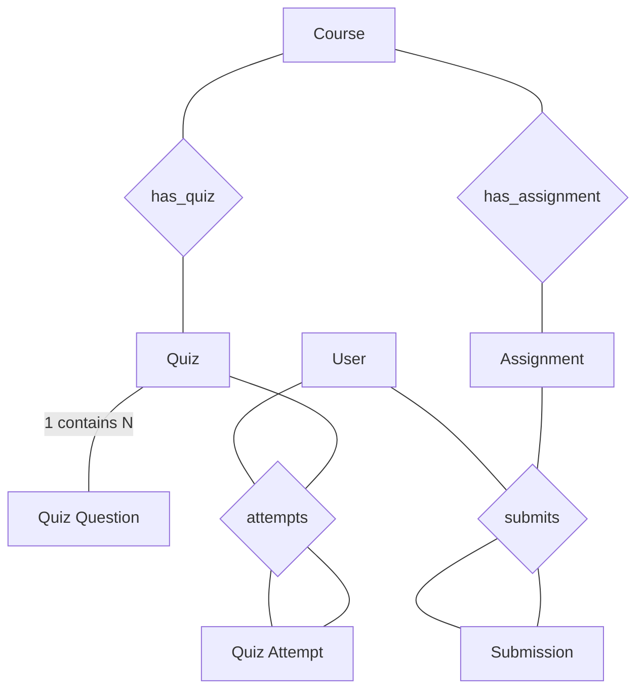
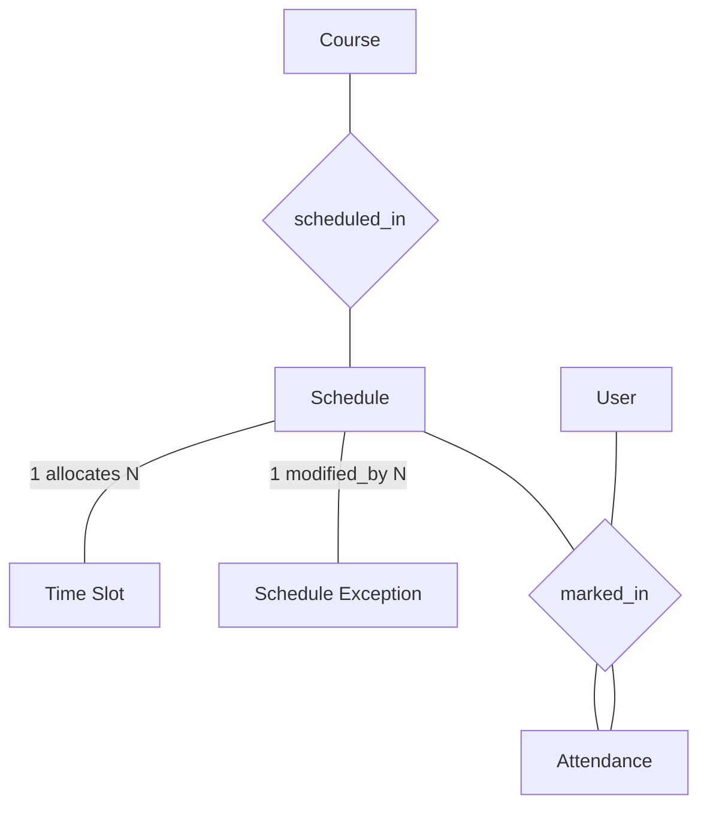
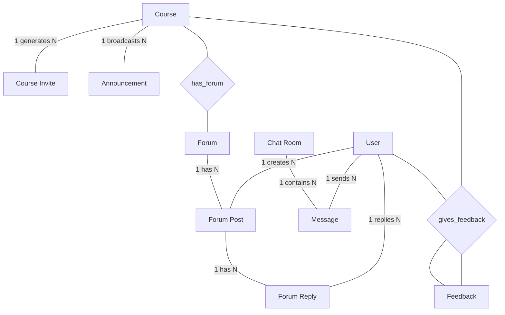

# 3. Functional Requirements

## 3.1 System Functional Overview
This section provides an overview of the LMS software system functionality, including screen flows, descriptions, role authorizations, and background non-screen functions.

### 3.1.1 Screens Flow
The diagram below illustrates the navigation flow between screens in the LMS system (applicable to all 3 roles: Student, Teacher, Admin).


*(Note: Rectangles display standard screens, Oval shapes `(( ))` display Popup or quick action forms, Hexagon shapes `{ }` represent role-based authorization gateways).*

### 3.1.2 Screen Descriptions
Detailed list of screens appearing in the Screens Flow.

| # | Feature | Screen | Description |
|---|---|---|---|
| 1 | Authentication | **User Login** | Login screen for Student, Teacher, and Admin (session/JWT management). |
| 2 | Authentication | **User Register** | Account registration and Email verification screen via OTP. |
| 3 | Authentication | **Reset Password** | Password recovery request screen for users who forgot their password. |
| 4 | Catalog | **Subject Catalog** | Screen to browse the subject directory with search, filter, and pagination features. |
| 5 | Catalog | **Courses List** | Screen listing the courses or classes belonging to a specific subject. |
| 6 | Course | **Course Details** | Detailed view of a course, displaying the Syllabus and Self-Enroll button. |
| 7 | Dashboard | **Dashboard (PostLogin)** | Post-login home screen showing study schedule, enrolled courses, and general announcements. |
| 8 | Account | **User Profile** | Screen to manage personal information and update user bio. |
| 9 | Learning | **Learning Viewer** | Main learning interface, displaying lectures, downloadable attachments, and tracking study time. |
| 10 | Assessment | **Take Quiz** | Screen for taking multiple-choice quizzes with a countdown timer and anti-cheat warnings. |
| 11 | Assessment | **Submit Assignment** | Screen to submit essay assignments (file upload). |
| 12 | Interaction | **Forums & Discussions** | Course discussion forum screen. |
| 13 | Interaction | **Messages / Chat** | Interface for direct messaging, group chat, and Video calls (WebRTC). |
| 14 | Notifications | **Announcements** | Screen to view bulletin boards and Push Alerts history. |
| 15 | Feedback | **Course Feedback** | Screen allowing students to review courses/teachers (1-5 Star Rating). |
| 16 | Teacher Portal | **Manage Courses** | Screen for Teachers to create course drafts and build the curriculum/syllabus. |
| 17 | Teacher Portal | **Question Bank** | Screen to manage the question bank (Import/Export XML). |
| 18 | Teacher Portal | **Grading Console** | Screen for grading essays and managing student transcripts. |
| 19 | Teacher Portal | **Attendance** | Screen to mark daily attendance and view class attendance rosters. |
| 20 | Admin Console | **Manage Users** | Screen to manage all user accounts on the system. |
| 21 | Admin Console | **Manage Subjects** | Screen for Admins to define subjects and map the prerequisite tree (Prerequisites Map). |
| 22 | Admin Console | **Approve Courses** | Screen to approve or reject course drafts from Teachers. |

### 3.1.3 Screen Authorization
Detailed authorization matrix for actions on each screen for the 3 user groups (Student, Teacher, Admin).

| Screen | Student | Teacher | Admin |
|---|---|---|---|
| **User Login** | X | X | X |
| **User Register** | X | X | |
| **User Profile** | Update Own Data | Update Own Data | Update All Data |
| **Subject Catalog** | Query All Data | Query All Data | Update All Data |
| **Course Details** | Query All Data | Update Managed Data | Update All Data |
| **Dashboard** | Query Own Data | Query Managed Data | Query All Data |
| **Learning Viewer** | Query Own Data | Query Managed Data | Query All Data |
| **Take Quiz** | Add New Data | Query Managed Data | Query All Data |
| **Submit Assignment** | Add New Data | Query Managed Data | Query All Data |
| **Forums & Discussions** | Add New Data | Add New Data | Delete Data |
| **Messages / Chat** | Add New Data | Add New Data | Query All Data |
| **Course Feedback** | Add New Data | Query Managed Data | Query All Data |
| **Manage Courses** | | Add / Update Own Data | Query All Data |
| **Question Bank** | | Update Own Data | Query All Data |
| **Grading Console** | | Update Managed Data | Query All Data |
| **Attendance** | Query Own Data | Update Managed Data | Query All Data |
| **Manage Users** | | | Add / Update All Data |
| **Manage Subjects** | | Query All Data | Update All Data |
| **Approve Courses** | | | Update All Data |

### 3.1.4 Non-Screen Functions
List of background jobs, external systems, and API services without a direct visual interface.

| # | Feature | System Function | Description |
|---|---|---|---|
| 1 | Auth | **Email OTP Trigger** | External API service (Resend Mail) to send OTPs for registration and password resets. |
| 2 | Content | **S3 File Upload API** | Cloud storage system (MinIO API) handling the upload of course materials and submissions (pdf, video). |
| 3 | Attendance | **Absence Cron Job** | Background process that periodically scans attendance data; automatically sends Email warnings if a student exceeds 20% absences. |
| 4 | Assessment | **Quiz Auto-Save** | Real-time auto-save mechanism for quiz attempts to prevent data loss upon disconnection. |
| 5 | Catalog | **Prerequisite Validation** | Automated logic to check if a student has passed all prerequisite subjects before unlocking Self-Enroll. |
| 6 | Enrollment | **Cooldown & Capacity Limit** | Anti-spam mechanism enforcing cooldown timers and locking enrollments when a class reaches its capacity limit. |
| 7 | Communication | **WebRTC Signaling** | Gateway using Socket.io to route direct video calls and maintain online chat status. |
| 8 | Assessment | **Question Scrambler** | Algorithm that randomly shuffles tests and questions from a shared Question Pool each time a student starts a quiz. |

### 3.1.5 Entity Relationship Diagrams
To ensure clarity and avoid visual clutter, the system's database schema is divided into a high-level **Core Domain ERD** and five detailed **Sub-module ERDs**.

#### 3.1.5.1 Core Domain ERD (Simplified Overview)
This diagram illustrates the primary high-level entities and relationships representing the core academic and enrollment flow of the LMS.



---

#### 3.1.5.2 Sub-module ERDs (Detailed Functional Views)

##### 1. User Authentication & Support
Handles user sessions, security/verification codes, push notifications, and blogs.



##### 2. Syllabus & Learning Content
Tracks course structures, uploaded files/materials, and student learning progress metrics.



##### 3. Examinations & Assessments
Covers multiple-choice quizzes, scoring/question banks, homework assignments, and grading submissions.



##### 4. Timetable & Attendance
Coordinates class weekly calendars, classroom allocations, scheduling exceptions, and student daily attendance logs.



##### 5. Forums & Communication
Powers community chat rooms, instant messaging, course announcements, invitations, and course feedback ratings.



---

### 3.1.6 Entity Directory (All 31 Entities)
Below is the comprehensive catalog of all database tables/entities represented in the schema.

| # | Entity | Description |
|---|---|---|
| 1 | User | Represents all actors in the system (Students, Teachers, Admins) and their authentication details. |
| 2 | Session | Tracks active login sessions and device information for Users. |
| 3 | Verification Code | Stores temporary OTPs used for email verification and password resets. |
| 4 | Specialist | Represents a broad academic specialization encompassing multiple Majors. |
| 5 | Major | Represents an academic department or major field of study. |
| 6 | Subject | Represents a specific subject/catalog item (e.g., "Math 101"). A subject belongs to a Major. |
| 7 | Semester | Represents an academic term or semester during which courses are offered. |
| 8 | Course | Represents a specific class or section of a Subject offered in a given Semester. |
| 9 | Course Invite | Secure, expiring tokens/links used to invite Students to self-enroll in a Course. |
| 10 | Enrollment | Tracks the registration of a Student in a specific Course, including final grades. |
| 11 | Lesson | Represents a single lecture or chapter within a Course syllabus. |
| 12 | Lesson Material | Documents, PDFs, or Video attachments uploaded to S3 for a specific Lesson. |
| 13 | Lesson Progress | Tracks a Student's completion status and time spent on a specific Lesson. |
| 14 | Quiz | Represents a multiple-choice assessment within a Course. |
| 15 | Quiz Question | Represents an individual question belonging to a Quiz pool. |
| 16 | Quiz Attempt | Records a Student's specific instance of taking a Quiz, including answers and score. |
| 17 | Assignment | Represents an essay or file-upload based task assigned to Students. |
| 18 | Submission | Records a Student's uploaded homework file and the Teacher's grading feedback. |
| 19 | Schedule | Defines the general timetable and room allocation for a Course. |
| 20 | Time Slot | Defines specific blocks of time within a Schedule (e.g., 9:00 AM - 10:30 AM). |
| 21 | Schedule Exception | Tracks specific cancellations, make-up classes, or room changes for a Schedule. |
| 22 | Attendance | Tracks the presence, absence, or tardiness of a Student for a specific schedule event. |
| 23 | Forum | Represents the main discussion board container for a Course. |
| 24 | Forum Post | Represents a specific topic/thread created by a User within a Forum. |
| 25 | Forum Reply | Represents comments or answers replying to a Forum Post. |
| 26 | Chat Room | Defines a 1-to-1 or group container for real-time WebSocket messaging. |
| 27 | Message | Represents an individual chat text or attachment sent within a Chat Room. |
| 28 | Notification | System-generated push alerts sent to a User. |
| 29 | Announcement | Course-wide or Campus-wide bulletin broadcasts. |
| 30 | Blog | Public articles or news posts authored by Teachers or Admins. |
| 31 | Feedback | Anonymous ratings and qualitative evaluations submitted by Students. |

---

### 3.1.7 Entity Relationships Cardinality Tables
The tables below specify the exact multiplicity (cardinality) of the relations (e.g., `1:N`, `1:1`, etc.) between the entities, divided by their respective modules as shown in the diagrams above.

#### 1. Core Domain Academic Flow Cardinality Table
This table describes the baseline scholastic and administrative relationships of the LMS.

| No. | Source Entity | Relationship (Verb) | Target Entity | Multiplicity | Description |
|---|---|---|---|---|---|
| 1 | **Specialist** | belongs_to | **Major** | 1:N | A Specialist contains/manages multiple Majors. |
| 2 | **Major** | contains | **Subject** | 1:N | A Major curriculum contains multiple Subjects. |
| 3 | **Subject** | has_sections | **Course** | 1:N | A Subject can be instantiated into multiple class sections (Courses). |
| 4 | **Semester** | offered_in | **Course** | 1:N | An academic term (Semester) offers multiple active Courses. |
| 5 | **User** | enrolls_in | **Enrollment** | 1:N | A Student User enrolls in courses, creating multiple Enrollment records. |
| 6 | **Course** | has_enrollment | **Enrollment** | 1:N | A Course can have multiple student Enrollments. (Represented as M:N between User and Course resolved via Enrollment). |
| 7 | **Course** | has_lesson | **Lesson** | 1:N | A Course syllabus is structured into multiple Lessons. |
| 8 | **Course** | has_quiz | **Quiz** | 1:N | A Course contains multiple evaluation Quizzes. |
| 9 | **Course** | has_assignment | **Assignment** | 1:N | A Course includes multiple homework Assignments. |

#### 2. User Authentication & Support Cardinality Table
This table describes the session management, security verification, and peripheral account features.

| No. | Source Entity | Relationship (Verb) | Target Entity | Multiplicity | Description |
|---|---|---|---|---|---|
| 1 | **User** | has | **Session** | 1:N | A User can have multiple concurrent active login Sessions. |
| 2 | **User** | requests | **Verification Code** | 1:N | A User can request multiple verification codes or OTPs over time. |
| 3 | **User** | receives | **Notification** | 1:N | A User receives multiple system-generated Push Alerts. |
| 4 | **User** | authors | **Blog** | 1:N | A Teacher or Admin User authors multiple public Blog articles. |

#### 3. Syllabus & Learning Content Cardinality Table
This table describes the lecture structure and individual lesson progression tracking.

| No. | Source Entity | Relationship (Verb) | Target Entity | Multiplicity | Description |
|---|---|---|---|---|---|
| 1 | **Course** | has_lesson | **Lesson** | 1:N | A Course syllabus is structured into multiple Lessons. |
| 2 | **Lesson** | contains | **Lesson Material** | 1:N | A Lesson has multiple attachments (PDFs, Videos) as learning materials. |
| 3 | **User** | tracks | **Lesson Progress** | 1:N | A Student User's individual study progress is recorded for multiple lessons. |
| 4 | **Lesson** | has_progress | **Lesson Progress** | 1:N | A Lesson's completion status is tracked for multiple student Users. (Represented as M:N between User and Lesson resolved via Lesson Progress). |

#### 4. Examinations & Assessments Cardinality Table
This table describes homework submissions, grades, quiz attempts, and evaluation pools.

| No. | Source Entity | Relationship (Verb) | Target Entity | Multiplicity | Description |
|---|---|---|---|---|---|
| 1 | **Course** | has_quiz | **Quiz** | 1:N | A Course contains multiple evaluation Quizzes. |
| 2 | **Course** | has_assignment | **Assignment** | 1:N | A Course includes multiple homework Assignments. |
| 3 | **Quiz** | contains | **Quiz Question** | 1:N | A Quiz consists of multiple evaluation questions. |
| 4 | **User** | attempts | **Quiz Attempt** | 1:N | A Student User can take quizzes, resulting in multiple Quiz Attempts. |
| 5 | **Quiz** | has_attempts | **Quiz Attempt** | 1:N | A Quiz aggregates multiple historical attempts from students. (Represented as M:N between User and Quiz resolved via Quiz Attempt). |
| 6 | **User** | submits | **Submission** | 1:N | A Student User submits multiple homework uploads over time. |
| 7 | **Assignment** | receives | **Submission** | 1:N | An Assignment receives submissions from multiple enrolled students. (Represented as M:N between User and Assignment resolved via Submission). |

#### 5. Timetable & Attendance Cardinality Table
This table describes course schedules, booking details, and student attendance sheets.

| No. | Source Entity | Relationship (Verb) | Target Entity | Multiplicity | Description |
|---|---|---|---|---|---|
| 1 | **Course** | scheduled_in | **Schedule** | 1:N | A Course has one or more recurring timetables (Schedules). |
| 2 | **Schedule** | allocates | **Time Slot** | 1:N | A Schedule allocates specific weekly time slots (days, start/end times). |
| 3 | **Schedule** | modified_by | **Schedule Exception** | 1:N | A Schedule can have multiple exceptions (cancellations, make-up classes). |
| 4 | **User** | marked_in | **Attendance** | 1:N | A Student User has their daily presence tracked in multiple Attendance records. |
| 5 | **Schedule** | logs | **Attendance** | 1:N | A class Schedule event tracks daily attendance for multiple enrolled students. (Represented as M:N between User and Schedule resolved via Attendance). |

#### 6. Forums & Communication Cardinality Table
This table describes course forums, postings, instant messaging, feedback, announcements, and invitations.

| No. | Source Entity | Relationship (Verb) | Target Entity | Multiplicity | Description |
|---|---|---|---|---|---|
| 1 | **Course** | has_forum | **Forum** | 1:1 | A Course has a single dedicated discussion Forum. |
| 2 | **Forum** | has | **Forum Post** | 1:N | A Forum holds multiple discussion topics (Posts). |
| 3 | **User** | creates | **Forum Post** | 1:N | A User (Student, Teacher, Admin) can publish multiple Forum Posts. |
| 4 | **Forum Post** | has | **Forum Reply** | 1:N | A Forum Post can receive multiple discussion replies. |
| 5 | **User** | replies | **Forum Reply** | 1:N | A User can write multiple replies across various Forum Posts. |
| 6 | **Chat Room** | contains | **Message** | 1:N | A Chat Room serves as a container for multiple instant Messages. |
| 7 | **User** | sends | **Message** | 1:N | A User can send multiple Messages in chat rooms. |
| 8 | **User** | gives_feedback | **Feedback** | 1:N | A Student User can submit feedback ratings for various courses. |
| 9 | **Course** | receives_feedback | **Feedback** | 1:N | A Course receives multiple qualitative evaluations (Feedback) from students. (Represented as M:N between User and Course resolved via Feedback). |
| 10 | **Course** | generates | **Course Invite** | 1:N | A Course generates multiple invite links/tokens for self-enrollment. |
| 11 | **Course** | broadcasts | **Announcement** | 1:N | A Course issues multiple broadcast Announcements. |

---

## 3.2 Feature Module: User Authentication & Account Security (Auth & Users)

### 3.2.1 Function: User Login
- **Function Trigger**: Triggered by user selecting the "Log In" button on the Home Page, or automatically redirected by backend middleware when requesting protected endpoints without valid credentials.
- **Function Description**:
  - **Actors**: Student, Teacher, Admin.
  - **Purpose**: Authenticates user identity and initializes secure session credentials in the client browser.
  - **Data Processing**: Receives and processes username/email and plaintext password. Validates matches within the MongoDB `User` collection. Hashed password validation is executed using bcrypt. If verified, the server generates an `accessToken` (valid for 15 minutes) and a `refreshToken` (valid for 7 days), securely writing them as **Secure HTTP-Only Cookies** using `cookie-parser` to safeguard sessions against client-side scripting (XSS) injection.
- **Screen Layout (ASCII Mock-up)**:
```text
+-------------------------------------------------------------+
|   LMS PORTAL                                  [Register]    |
+-------------------------------------------------------------+
|                                                             |
|                   WELCOME BACK TO LMS                       |
|          Please enter your credentials to log in            |
|                                                             |
|      Email or Username:                                     |
|      [ student@lms.edu                           ]          |
|                                                             |
|      Password:                                              |
|      [ ****************                          ]          |
|                                                             |
|      ( ) Remember me on this device                         |
|                                                             |
|               +-----------------------------+               |
|               |           LOG IN            |               |
|               +-----------------------------+               |
|                                                             |
|      [Forgot Password?]                       [Resend OTP]  |
+-------------------------------------------------------------+
```
- **Function Details**:
  - **Data & Input Validation**: Email/Username must be a minimum of 3 characters. Password must be a minimum of 8 characters. Form validations are verified client-side and enforced at the API layer with Zod schemas.
  - **Business Rules**:
    - *Normal Case*: Correct credentials. A new record is added to the `Session` collection, secure cookies are set, and the client redirects to the post-login `/dashboard`.
    - *Abnormal Case 1 - Unverified Email*: The email belongs to an account with `isVerified: false`. The API yields a 400 Bad Request with `MSG-AUTH-02`, and the user is navigated to the OTP verification view.
    - *Abnormal Case 2 - Invalid Credentials*: The password or user does not exist. Returns a 401 Unauthorized using `MSG-AUTH-01` message.

### 3.2.2 Function: User Register & OTP Email Verification
- **Function Trigger**: Navigation path: Home Page -> Click "Register" -> Fill form -> Redirects to OTP screen. Triggered automatically on form submit.
- **Function Description**:
  - **Actors**: Student, Teacher.
  - **Purpose**: Creates an inactive user profile and activates it upon verifying the email via a secure email OTP.
  - **Data Processing**: Captures username, email, password, and fullname. Securely hashes the password with bcrypt, initializes the user profile in MongoDB, triggers an asynchronous email dispatch containing a **6-digit numeric OTP** via the **Resend API**, and writes a temporary code to the `VerificationCode` collection.
- **Screen Layout (ASCII Mock-up)**:
```text
+-------------------------------------------------------------+
|   LMS PORTAL                                     [Log In]   |
+-------------------------------------------------------------+
|                                                             |
|                   VERIFY YOUR ACCOUNT                       |
|      A 6-digit verification code was sent to your email     |
|                                                             |
|      Enter 6-digit Code:                                    |
|      [ 7 ] [ 1 ] [ 9 ] [ 3 ] [ 0 ] [ 4 ]                    |
|                                                             |
|               +-----------------------------+               |
|               |      VERIFY & ACTIVATE      |               |
|               +-----------------------------+               |
|                                                             |
|      Didn't receive code? [Resend Verification Email]       |
+-------------------------------------------------------------+
```
- **Function Details**:
  - **Data & Input Validation**: Form input must contain unique username and email addresses not present in the database. Password must contain at least 8 characters consisting of both letters and numbers (enforced in `user.model.ts` validations).
  - **Business Rules**:
    - *Normal Case*: The user inputs the correct code matching the database active OTP code. The server sets `isVerified: true`, clears the `VerificationCode` document, and enables account login access.
    - *Abnormal Case 1 - Code Expiry*: Codes expire exactly after 15 minutes. Verification requests sent after expiration trigger an immediate 400 Bad Request prompting the user to click "Resend" to issue a fresh OTP.
    - *Abnormal Case 2 - Attempt Lock*: Typing a wrong OTP multiple times increments validation failures; the code gets invalidated upon reaching 5 failures.

### 3.2.3 Function: Reset Password Recovery
- **Function Trigger**: Triggered by user navigating to `/forgot-password` via the login screen link.
- **Function Description**:
  - **Actors**: Student, Teacher, Admin.
  - **Purpose**: Allows users to recover access to their accounts via secure verification codes.
  - **Data Processing**: Receives the target account's email, creates an secure OTP in `VerificationCode`, dispatches it via the Resend Email Service, verifies input on the reset form, and securely resets the user's hashed password in MongoDB.

---

## 3.3 Feature Module: Curriculum & Catalog Management (Subjects & Specialists)

### 3.3.1 Function: Manage Subjects & Prerequisites Map (Admin Console)
- **Function Trigger**: Accessed via Admin Dashboard -> Admin Console -> Select "Manage Subjects" sidebar item. URL: `/admin/subjects`.
- **Function Description**:
  - **Actors**: Administrator.
  - **Purpose**: Defines course items, structural majors, academic specializations, and maps mandatory prerequisite paths.
  - **Data Processing**: Seeds and updates academic listings in `Subject`, `Major`, and `Specialist` collections, matching prerequisite IDs into child documents to form the prerequisite dependencies tree.
- **Screen Layout (ASCII Mock-up)**:
```text
+-------------------------------------------------------------+
|  ADMIN CONSOLE  |  Manage Users   |  [Manage Subjects]      |
+-------------------------------------------------------------+
|                                                             |
|  SUBJECT CATALOG DIRECTORY                    [+ Add Subject] |
|  Search: [ SWE-301           ]  Filter Major: [Software Eng] |
|                                                             |
|  ID      Subject Name  Code     Prerequisites        Action |
|  [01]    Software Eng  SWE-301  SWE-201, SWE-102     [Edit] |
|  [02]    Database Sys  DB-202   DB-101               [Edit] |
|  [03]    Core Java     JV-101   None                 [Edit] |
|                                                             |
|  * Prerequisites Map visualization is loaded via Recharts.  |
+-------------------------------------------------------------+
```
- **Function Details**:
  - **Data & Input Validation**: Subject Code must be a unique, uppercase alphanumeric slug (e.g., `SWE-301`). Name must be unique.
  - **Business Rules**:
    - *Normal Case*: Admin specifies details. If the prerequisite IDs exist, Mongoose creates a binding.
    - *Abnormal Case - Circular Dependency*: Admin attempts to configure `Subject A` as a prerequisite for `Subject B`, while `Subject B` is already a prerequisite for `Subject A`. Validation algorithm checks recursive tree paths and returns a 400 Bad Request, blocking save operations.

### 3.3.2 Function: Browse Subject Catalog (Student & Teacher View)
- **Function Trigger**: Publicly accessible on the Home Page -> "Subject Catalog" navigation button. URL: `/subjects`.
- **Function Description**:
  - **Actors**: Student, Teacher, Guest (Anonymous).
  - **Purpose**: Allows users to query the school's syllabus curricula catalog with paginated, filtered listings.

---

## 3.4 Feature Module: Course & Section Management (Courses)

### 3.4.1 Function: Manage Courses & Syllabus (Teacher Portal)
- **Function Trigger**: Navigation: Teacher Dashboard -> Teacher Portal -> Click "Manage Courses". URL: `/portal/courses`.
- **Function Description**:
  - **Actors**: Teacher.
  - **Purpose**: Enables instructors to configure class sections, upload course syllabi, set enrollment passwords, and build course sections.
  - **Data Processing**: Writes Course data to MongoDB. Course entities default to `DRAFT` status and are locked from active student enrollment until Admin publication.
- **Screen Layout (ASCII Mock-up)**:
```text
+-------------------------------------------------------------+
|  TEACHER PORTAL  |  [Manage Courses]  |  Question Bank      |
+-------------------------------------------------------------+
|                                                             |
|  MY COURSES SYLLABUS BUILDER                   [+ New Draft] |
|                                                             |
|  Course Title      Code      Status     Students     Action |
|  Introduction SE   SWE301_a  ONGOING    32 / 40      [Edit] |
|  Advanced Web Dev  AWD_01    DRAFT      0 / 30       [Syllabus]|
|                                                             |
|  Syllabus Chapters:                                         |
|  - Chapter 1: Express API Frameworks          [+ Add Lesson] |
|  - Chapter 2: Mongoose Schemas & Hooks        [+ Add Lesson] |
+-------------------------------------------------------------+
```
- **Function Details**:
  - **Data & Input Validation**: Course section capacity must be a positive integer (max limit 100). If an enrollment password is set, it must be hashed before storage.
  - **Business Rules**:
    - *Normal Case*: Instructor edits syllabus items of a DRAFT or ONGOING course section. Changes are saved directly to `Course` and `Lesson` schemas.
    - *Abnormal Case - Modification Restricton*: If a course status becomes `COMPLETED` or the `endDate` is passed, the system locks the course; any syllabus updates trigger a 400 Bad Request.

### 3.4.2 Function: Approve Course Drafts (Admin Console)
- **Function Trigger**: Accessed via Admin Dashboard -> Admin Console -> "Approve Courses". URL: `/admin/approvals`.
- **Function Description**:
  - **Actors**: Administrator.
  - **Purpose**: Validates teacher specialties and publishes course sections to `ONGOING` status.
  - **Business Rules (Specialization Validation)**:
    - *Teacher Specialization Check*: Compares the Course's `Subject` category with the assigned Teacher's `Specialist` profile. If they do not match, the approval triggers a 400 Bad Request and halts execution (enforced in `course.service.ts` to guarantee academic eligibility).

---

## 3.5 Feature Module: Course Enrollment & Invitation (Enrollments)

### 3.5.1 Function: Course Self-Enrollment & Verification
- **Function Trigger**: Student navigates to `/courses/:id` -> Clicks "Self-Enroll" button.
- **Function Description**:
  - **Actors**: Student.
  - **Purpose**: Evaluates candidate prerequisite criteria, checks capacity slots, validates enrollment password keys, and records active enrollments.
  - **Data Processing**: Evaluates entries in the `Enrollment` collection to ensure that all prerequisites in the `Subject` are passed. Updates class capacity indices, prompts the student for an optional section password check, and updates the `Enrollment` schema.
- **Screen Layout (ASCII Mock-up)**:
```text
+-------------------------------------------------------------+
|   COURSE DETAILS                                [Dashboard] |
+-------------------------------------------------------------+
|                                                             |
|   TITLE: Advanced Software Engineering (ASE-401)            |
|   Instructor: Prof. Jane Doe      Status: Ongoing           |
|   Prerequisites required: Software Engineering (SWE-301)     |
|                                                             |
|   Course Enrollment Password Required:                      |
|   [ **************** ]                                      |
|                                                             |
|                  +--------------------------+               |
|                  |     CONFIRM ENROLL       |               |
|                  +--------------------------+               |
|                                                             |
+-------------------------------------------------------------+
```
- **Function Details**:
  - **Business Rules**:
    - *Prerequisite Map Validation*: Evaluates past enrollments for `studentId`. If any prerequisite subject does not contain a record marked `status: "completed"`, self-enrollment fails immediately with an error.
    - *Enrollment Spam Cooldown*: Applies a **1-minute cooldown timer** (`COOLDOWN_MINUTES = 1` in backend `enrollment.service.ts`). Re-enrolling within this timeframe triggers a cooldown warning displaying the remaining seconds.
    - *Capacity Check*: If the enrolled count equals the defined course capacity, returns a 400 Bad Request.

### 3.5.2 Function: Secure Course Invite Links
- **Function Trigger**: Accessed via Teacher Portal -> Course Dashboard -> Click "Generate Invite Link" button.
- **Function Description**:
  - **Actors**: Teacher, Admin.
  - **Purpose**: Creates highly customizable invitation tokens bypass keys (`CourseInvite` model) that let students join classes instantly without manual approval.
  - **Data Processing**: Generates an expiring secure UUID token matching usage boundaries, saving it to MongoDB.

---

## 3.6 Feature Module: Learning Viewer & Lesson Progress (Lessons)

### 3.6.1 Function: Lesson & Materials Viewer
- **Function Trigger**: Student logs in -> Dashboard -> Clicks active enrolled Course -> Clicks lesson index chapter. URL: `/learning/:courseId/lessons/:lessonId`.
- **Function Description**:
  - **Actors**: Student.
  - **Purpose**: Serves curriculum slides, lecture notes, and instructional videos stored inside secure storage.
  - **Data Processing**: Pulls metadata from `LessonMaterial` models and generates temporary presigned URLs from **MinIO (S3 API)** to fetch and stream file binaries safely to the web client.

### 3.6.2 Function: Task-Time Progress Tracker (Non-Screen)
- **Function Trigger**: Emits periodic XML/JSON heartbeats from the client browser every 10 seconds while a lesson viewer tab is active.
- **Function Description**:
  - **Actors**: Student (System automated tracking).
  - **Purpose**: Tracks student learning time (`timeSpentSeconds`) and logs timestamps for the curriculum registry.
  - **Data Processing**: Increments task timers inside `LessonProgress` schema and writes the `lastAccessedAt` timestamp.

---

## 3.7 Feature Module: Examination & Assessment Pool (Quizzes)

### 3.7.1 Function: Quiz Question Bank XML Import/Export (Teacher Portal)
- **Function Trigger**: Accessed via Teacher Portal -> "Question Bank" -> Click "Import XML" or "Export XML" button. URL: `/portal/questions/xml`.
- **Function Description**:
  - **Actors**: Teacher, Admin.
  - **Purpose**: Enables bulk upload or database transfer of multiple-choice and structural examination questions.
  - **Data Processing**: Parsed using the backend `xml2js` module, converting parsed structures into standard `QuizQuestion` schemas.

### 3.7.2 Function: Real-Time Quiz Examination & Auto-Save
- **Function Trigger**: Student enters a quiz section and selects "Start Quiz Attempt". URL: `/learning/:courseId/quiz/:quizId/take`.
- **Function Description**:
  - **Actors**: Student.
  - **Purpose**: Delivers randomized quizzes with active session timers, auto-saving choices to protect against client network drops.
  - **Data Processing**: Shuffles question sequences (`Question Scrambler`), writes a `QuizAttempt` record, and activates a secure backend countdown timer.
- **Screen Layout (ASCII Mock-up)**:
```text
+-------------------------------------------------------------+
|   QUIZ SESSION: Midterm Exam                     [ 44:59 ]  |
+-------------------------------------------------------------+
|                                                             |
|   Question 3 of 20:                                         |
|   Which Mongoose hook executes directly before document save?|
|                                                             |
|   ( ) A. post('save')                                       |
|   (*) B. pre('save')             <-- Saved (Auto-save)      |
|   ( ) C. pre('update')                                      |
|   ( ) D. post('validate')                                   |
|                                                             |
|   [<< Previous]                               [Next >>]     |
|                                                             |
|   +-------------------------------------------------------+ |
|   | [1]  [2]  [*3] [4]  [5]  [6]  [7]  [8]  [9]  [10]     | |
|   +-------------------------------------------------------+ |
+-------------------------------------------------------------+
```
- **Function Details**:
  - **Business Rules**:
    - *Auto-Save Execution*: As the user selects radio answers, the client fires a `PUT /quiz-attempts/:id/auto-save` update. The API saves selections instantly into `QuizAttempt` to prevent data loss.
    - *Countdown Lock*: The moment the server clock determines time limit expiry, the API locks the attempt, updates status to `completed`, calculates final grades, and returns `MSG-QZ-01`.

### 3.7.3 Function: Quiz Cheating Auditing & Scores Re-grading
- **Function Trigger**: Triggered by Teacher auditing active quiz attempts from the grading console.
- **Function Description**:
  - **Actors**: Teacher, Admin.
  - **Purpose**: Enforces anti-cheat compliance by allowing instructors to invalidate or recalculate quiz submissions.
  - **Business Rules**:
    - *Ban Action*: Instructors can invoke `PUT /quiz-attempts/:id/ban`, changing status to `banned` and setting the grade to `0`. The student is locked out and receives `MSG-SYS-04`.
    - *Re-grading Exception*: In the event of system failures, instructors can recalculate grades by invoking the re-grading API.

---

## 3.8 Feature Module: Assignments & Submissions (Assignments)

### 3.8.1 Function: Manage Essay Assignments
- **Function Trigger**: Teacher Portal -> Select "Assignments" -> Clicks "Create Assignment". URL: `/portal/assignments/create`.
- **Function Description**:
  - **Actors**: Teacher, Admin.
  - **Purpose**: Configures essay questions, attaches resource guides, and determines deadlines.

### 3.8.2 Function: Essay Submission & Grading Console
- **Function Trigger**: Student opens `/learning/:courseId/assignment/:id` -> Uploads file. Teacher opens `/portal/grading/:id` -> Evaluates file.
- **Function Description**:
  - **Actors**: Student, Teacher.
  - **Purpose**: Handles file submissions and allows instructors to write grading reviews.
- **Screen Layout (ASCII Mock-up)**:
```text
+-------------------------------------------------------------+
|  GRADING CONSOLE  |  Introduction to SE                     |
+-------------------------------------------------------------+
|                                                             |
|  Student Submission: John Doe (student@lms.edu)             |
|  Submitted File: [ design_pattern_report.pdf ] (1.8 MB)      |
|  Date Uploaded: 2026-05-24 14:02      Status: Submitted     |
|                                                             |
|  Assign Score (Scale 0-10):                                 |
|  [ 9.5 ] / 10.0                                             |
|                                                             |
|  Descriptive Feedback:                                      |
|  [ Well structured diagram. Excellent use of Singleton    ] |
|  [ pattern in connection pools.                           ] |
|                                                             |
|               +-----------------------------+               |
|               |       SUBMIT SCORE          |               |
|               +-----------------------------+               |
+-------------------------------------------------------------+
```
- **Function Details**:
  - **File Restrictions**: The uploaded file size must not exceed the system-enforced **20MB** limit. Returns `MSG-SYS-01` if the threshold is violated.

---

## 3.9 Feature Module: Schedules & Timetable Attendance (Timetables)

### 3.9.1 Function: Weekly Course Scheduling & Exceptions
- **Function Trigger**: Admin console -> Click "Schedules". URL: `/admin/schedules`.
- **Function Description**:
  - **Actors**: Admin, Teacher.
  - **Purpose**: Maps course sections to recurring weekly shifts, classrooms, and schedules exceptions.

### 3.9.2 Function: Roster Attendance Tracking
- **Function Trigger**: Accessed via Teacher Portal -> "Attendance" -> Select Course section and date session. URL: `/portal/attendance/:courseId`.
- **Function Description**:
  - **Actors**: Teacher, Admin, System Cron (Automated email alerts).
  - **Purpose**: Marks daily student presence and issues automated late warnings.
  - **Business Rules (Absence Cron Trigger)**:
    - *Absence Email warning*: A system cron checks attendance records daily. When a student's absences exceed **20%** of the scheduled slots, the server dispatches a warning warning via the Resend API (`MSG-ATT-01`) notifying the student and instructor of potential course suspension.

---

## 3.10 Feature Module: Forums & Real-Time Communication (Chat & Rooms)

### 3.10.1 Function: Course Forums & Discussion Threads
- **Function Trigger**: Accessed via Student/Teacher Dashboard -> Click Course -> "Forums". URL: `/learning/:courseId/forum`.
- **Function Description**:
  - **Actors**: Student, Teacher, Admin.
  - **Purpose**: Powers text discussions within class sections, supporting file attachments and nested replies.

### 3.10.2 Function: Real-Time Socket.io Chat Room & WebRTC Call
- **Function Trigger**: Accessed via global dashboard -> Click "Messages" sidebar. URL: `/chat`.
- **Function Description**:
  - **Actors**: Student, Teacher, Admin.
  - **Purpose**: Facilitates instant text exchanges and low-latency audio/video calling.
- **Screen Layout (ASCII Mock-up)**:
```text
+-------------------------------------------------------------+
|   REAL-TIME MESSENGER                         [📞 Call Video] |
+-------------------------------------------------------------+
|  Rooms         |  [👥 SWE-301 Group Chat]                   |
|  - General     |                                            |
|  - Group A     |  [Jane (Teacher)] (15:40):                  |
|  - Group B     |  Please submit the report by tonight!       |
|                |                                            |
|  Direct        |  [John (Student)] (15:42):                 |
|  - Jane        |  Yes, I'm uploading to S3 now.              |
|  - Bob         |                                            |
|                |  Type a message...                          |
|                |  [ Enter message here...         ] [📎 File] |
+-------------------------------------------------------------+
```
- **Function Details**:
  - **Real-Time Data Flow**: Uses persistent WebSockets configured with **Socket.io**. Messages are broadcasted in under 100ms. Attachment file limits are restricted to **20MB** via Multer memory buffers. Video calling runs on peer-to-peer WebRTC signaling routed through Socket.io events.

---

## 3.11 Feature Module: Quality Course Feedback System (Feedback)

### 3.11.1 Function: Student Feedback & Rating Dashboard
- **Function Trigger**: Student opens `/learning/:courseId/feedback`. URL: `/learning/:courseId/feedback`.
- **Function Description**:
  - **Actors**: Student, Teacher, Admin.
  - **Purpose**: Gathers anonymous star ratings and reviews to assess instructor performance.
  - **Business Rules**:
    - *Bypass Check*: Feedback forms support optional proof-of-complaint file attachments up to **20MB** routed directly to the MinIO object storage.

---

## 3.12 Feature Module: Announcements & Bulletin Manager (Announcements)

### 3.12.1 Function: Course & System Bulletins Manager
- **Function Trigger**: Teacher Portal -> Click "Announcements" -> Select "Create". URL: `/portal/announcements`.
- **Function Description**:
  - **Actors**: Teacher, Admin, Student (Reader).
  - **Purpose**: Publishes system bulletins or course-wide notifications.
