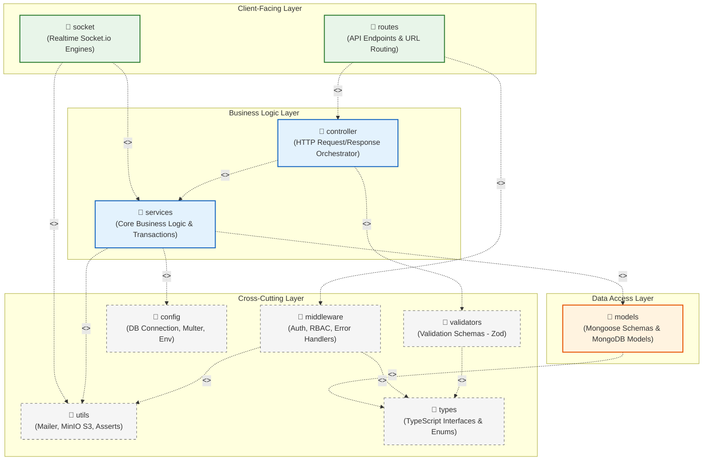

# 1. Code Packages - Source Code Structure Breakdown

This document presents the Package Diagram, explains package dependencies, naming conventions, and provides a detailed breakdown of each package in the **LMS Backend (ExpressJS + TypeScript)**.

---

## 1.1 Overall Package Diagram

Below is the UML diagram depicting the codebase packages and their dependency (`<<use>>`) relationships:

---

## 1.2 Package Dependencies & Architecture Rationale

The system architecture follows a clean **Layered Architecture** with strict Separation of Concerns (SoC) for maintainability and scalability:

1.  **Client-Facing Layer:**
    *   `routes`: Receives incoming HTTP requests from the frontend client (React + Vite). Binds route paths with security middleware (authentication, RBAC) and dispatches calls to target controllers.
    *   `socket`: Handles persistent bidirectional WebSockets connections (instant chat messaging, read receipts, and WebRTC video call signaling) using Socket.io.
2.  **Business Logic Layer:**
    *   `controller`: Orchestrates HTTP inputs and outputs. Validates payload formats using `validators` and delegates processing to `services`, returning standardized HTTP responses.
    *   `services`: Houses domain business logic (e.g., prerequisite verification algorithms, anti-spam enrollment cooldown, quiz auto-grading, and attendance stats). Directly interacts with `models` to persist and retrieve domain data.
3.  **Data Access Layer:**
    *   `models`: Defines Mongoose schemas, domain constraints, database indexes, hooks (pre-save), and provides strong typing for MongoDB collections.
4.  **Cross-Cutting Layer:**
    *   `middleware`, `validators`, `utils`, `config`, and `types` provide reusable helper modules and configurations shared across all upper layers.

---

## 1.3 Naming Conventions

To maintain consistency across the codebase, the following naming conventions are enforced:

*   **Package / Directory Names:** Lowercase words or singular/plural nouns (e.g., `routes`, `controller`, `services`, `models`, `middleware`, `validators`, `utils`).
*   **Router Files:** `camelCase` with `.route.ts` suffix (e.g., `auth.route.ts`, `attendance.route.ts`).
*   **Controller Files:** `camelCase` with `.controller.ts` suffix (e.g., `auth.controller.ts`, `assignment.controller.ts`).
*   **Service Files:** `camelCase` with `.service.ts` suffix (e.g., `auth.service.ts`, `enrollment.service.ts`).
*   **Model Files:** `camelCase` with `.model.ts` suffix (e.g., `user.model.ts`, `course.model.ts`).
*   **Middleware Files:** `camelCase` (e.g., `authenticate.ts`, `authorize.ts`, `errorHandler.ts`).
*   **Validator Files:** `camelCase` with `.schemas.ts` suffix (e.g., `course.schemas.ts`, `enrollment.schemas.ts`).

---

## 1.4 Package Descriptions Table

Detailed breakdown of the 11 core packages under `/src` in `BE_LMS`:

| No | Package | Description |
| :--- | :--- | :--- |
| **01** | **routes** | Registers and routes all application REST API endpoints (such as `/auth`, `/courses`, `/attendances`). Pairs routes with authentication/authorization middleware and directs execution flow to controllers. |
| **02** | **controller** | Serves as the HTTP presentation layer. Validates client payloads, calls service functions for business execution, and returns standardized JSON responses with proper HTTP status codes. |
| **03** | **services** | Implements core application business logic (e.g., prerequisite checks, registration cooldown, quiz attempts evaluation, attendance stats aggregation). Communicates with MongoDB via Mongoose models. |
| **04** | **models** | Defines domain entity schemas, indexes, hooks, and TypeScript types for Mongoose/MongoDB collections. |
| **05** | **middleware** | Intercepts HTTP requests for cross-cutting tasks including JWT token verification, role-based authorization (RBAC), rate limiting, and centralized error handling (`errorHandler`). |
| **06** | **validators** | Defines input validation schemas using Zod to sanitize and validate incoming request bodies, queries, and parameters before reaching service layers. |
| **07** | **socket** | Configures and manages WebSocket events via Socket.io, including chat rooms, live messaging, presence states, and WebRTC peer-to-peer video signaling. |
| **08** | **config** | Centralizes configuration modules: MongoDB connection initialization, Multer file upload settings, MinIO client configuration, and environment variable loaders. |
| **09** | **utils** | Reusable utility functions, such as email dispatching (`sendMail` via Resend), MinIO file uploads (`uploadFile`), app assertions (`appAssert`), and token helpers. |
| **10** | **types** | Declares global TypeScript interfaces, type definitions, and Enums used throughout the backend codebase. |
| **11** | **constants** | Houses global application constants including HTTP status codes, error message codes, and static configuration flags. |
