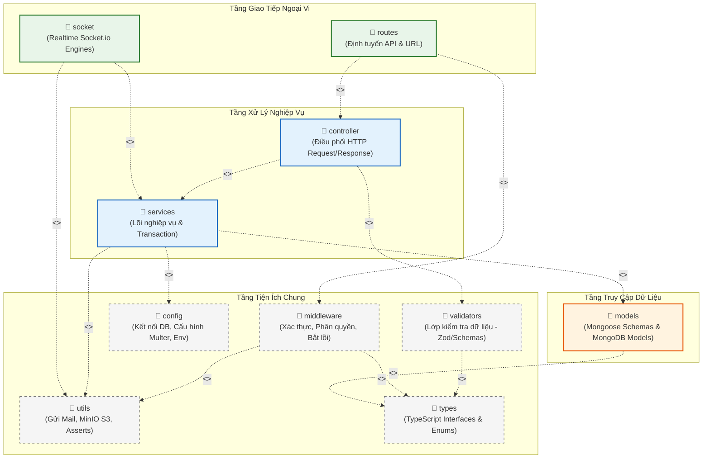

# 1. Code Packages - Phân rã cấu trúc Gói mã nguồn

Tài liệu này trình bày sơ đồ gói (Package Diagram), giải thích chi tiết mối quan hệ phụ thuộc giữa các gói, quy tắc đặt tên, và bảng mô tả vai trò của từng package trong dự án **LMS (Backend ExpressJS + TypeScript)**.

---

## 1.1 Sơ đồ Gói tổng thể (Overall Package Diagram)

Dưới đây là sơ đồ UML mô tả các package trong dự án và mối quan hệ sử dụng (`<<use>>`) giữa chúng:

---

## 1.2 Giải thích quan hệ phụ thuộc giữa các Gói (Explanation)

Kiến trúc hệ thống được xây dựng theo mô hình **layered architecture (kiến trúc phân tầng)** hướng đối tượng giúp mã nguồn tách biệt trách nhiệm (Separation of Concerns) và dễ dàng bảo trì:

1.  **Tầng Giao Tiếp Ngoại Vi (Client-Facing Layer):**
    *   `routes` nhận trực tiếp các yêu cầu HTTP từ người dùng (Frontend Vite/React). Nó sử dụng các `middleware` để xác thực quyền truy cập trước khi chuyển tiếp yêu cầu đến `controller`.
    *   `socket` quản lý các luồng dữ liệu thời gian thực hai chiều (tin nhắn chat, video calling) thông qua công cụ Socket.io.
2.  **Tầng Xử Lý Nghiệp Vụ (Business Logic Layer):**
    *   `controller` đóng vai trò nhạc trưởng điều phối. Nó sử dụng `validators` để đảm bảo dữ liệu gửi lên đúng định dạng, sau đó chuyển giao cho `services` để xử lý và đóng gói kết quả phản hồi HTTP.
    *   `services` là trái tim của ứng dụng. Đây là nơi duy nhất chứa các quy tắc nghiệp vụ, tính toán logic và giao tiếp với tầng `models` để thực thi truy vấn cơ sở dữ liệu.
3.  **Tầng Truy Cập Dữ Liệu (Data Access Layer):**
    *   `models` định nghĩa các thực thể và cấu trúc lược đồ Mongoose để lưu trữ và truy vấn trong MongoDB.
4.  **Tầng Tiện Ích Chung (Cross-Cutting Layer):**
    *   `middleware`, `validators`, `utils`, `config` và `types` là các gói chức năng bổ trợ, được import và tái sử dụng xuyên suốt bởi tất cả các tầng nghiệp vụ phía trên.

---

## 1.3 Quy tắc đặt tên Gói và Tệp nguồn (Naming Conventions)

Để duy trì tính nhất quán trên toàn bộ dự án, các quy tắc đặt tên sau đây được áp dụng nghiêm ngặt:

*   **Tên gói (Package/Folder names):** Luôn viết thường hoàn toàn, sử dụng danh từ số nhiều hoặc số ít đơn giản (Ví dụ: `routes`, `controller`, `services`, `models`).
*   **Tên tệp Router:** Đặt theo cấu trúc `camelCase` kết thúc bằng đuôi `.route.ts` (Ví dụ: `auth.route.ts`, `attendance.route.ts`).
*   **Tên tệp Controller:** Đặt theo cấu trúc `camelCase` kết thúc bằng đuôi `.controller.ts` (Ví dụ: `auth.controller.ts`, `assignment.controller.ts`).
*   **Tên tệp Service:** Đặt theo cấu trúc `camelCase` kết thúc bằng đuôi `.service.ts` (Ví dụ: `auth.service.ts`, `enrollment.service.ts`).
*   **Tên tệp Model:** Đặt theo cấu trúc `camelCase` kết thúc bằng đuôi `.model.ts` (Ví dụ: `user.model.ts`, `course.model.ts`).
*   **Tên tệp Middleware:** Đặt theo cấu trúc `camelCase` viết thường (Ví dụ: `authenticate.ts`, `authorize.ts`).
*   **Tên tệp Validator Schemas:** Đặt theo cấu trúc `camelCase` kết thúc bằng đuôi `.schemas.ts` (Ví dụ: `course.schemas.ts`).

---

## 1.4 Bảng Mô tả Gói (Package Descriptions Table)

Dưới đây là bảng phân rã chi tiết 11 gói mã nguồn chính trong thư mục `/src` của dự án `BE_LMS`:

| No | Package | Description |
| :--- | :--- | :--- |
| **01** | **routes** | Đăng ký và phân phối tất cả các API endpoints của hệ thống (như `/auth`, `/courses`, `/attendances`). Liên kết các Route với Middleware bảo mật và định hướng luồng yêu cầu đến đúng tệp Controller tương ứng. |
| **02** | **controller** | Đóng vai trò cầu nối tiếp nhận dữ liệu đầu vào từ HTTP Request. Gọi validator để kiểm tra tính hợp lệ của dữ liệu, gọi Service để thực thi nghiệp vụ cốt lõi, và phản hồi kết quả về phía Client bằng mã HTTP tương ứng. |
| **03** | **services** | Chứa toàn bộ các xử lý nghiệp vụ thực tế của hệ thống (ví dụ: thuật toán kiểm tra môn tiên quyết, thời gian cooldown đăng ký lớp học, hay thống kê trung bình điểm số). Giao tiếp trực tiếp với cơ sở dữ liệu thông qua các Model. |
| **04** | **models** | Định nghĩa lược đồ thực thể (Mongoose Schemas), các chỉ mục tìm kiếm tối ưu (Indexes), các bộ lắng nghe sự kiện (Pre-save Hooks), và cung cấp giao diện tương tác dữ liệu (MongoDB Collection Models) cho tầng Service. |
| **05** | **middleware** | Tập hợp các hàm trung gian xử lý các tác vụ xuyên suốt hệ thống như kiểm tra trạng thái đăng nhập (Authentication), phân quyền theo vai trò (Role-based Authorization), giới hạn tần suất yêu cầu và bắt lỗi tập trung (Global Error Handler). |
| **06** | **validators** | Định nghĩa các bộ lọc và cấu trúc schema xác thực dữ liệu (sử dụng Zod/Joi) cho từng API để ngăn chặn lỗi dữ liệu rác hoặc tấn công tiêm mã độc vào DB trước khi chuyển sang tầng nghiệp vụ. |
| **07** | **socket** | Thiết lập và quản lý toàn bộ các sự kiện thời gian thực (WebSockets) qua Socket.io bao gồm kết nối, phát tín hiệu video call (video call signaling) và truyền nhận tin nhắn tức thời trong phòng chat. |
| **08** | **config** | Cấu hình toàn bộ môi trường và thư viện thứ ba bao gồm kết nối cơ sở dữ liệu MongoDB, tích hợp bộ nhớ lưu trữ file MinIO (Multer/S3), cấu hình cổng email Resend và quản lý biến môi trường. |
| **09** | **utils** | Thư viện các hàm tiện ích dùng chung được đóng gói sẵn để tái sử dụng như: hàm gửi thư `sendMail`, hàm upload tệp MinIO `uploadFile`, và cấu trúc xác định lỗi ứng dụng tùy biến `appAssert`. |
| **10** | **types** | Khai báo toàn bộ các kiểu dữ liệu, các giao diện (Interfaces), kiểu định danh (Type aliases) và các tập hợp hằng số (Enums) của TypeScript dùng chung cho toàn bộ dự án. |
| **11** | **constants** | Lưu trữ các giá trị hằng số cố định xuyên suốt vòng đời ứng dụng bao gồm mã trạng thái HTTP (HTTP status codes), đường dẫn hệ thống mặc định và các cấu hình tĩnh. |
