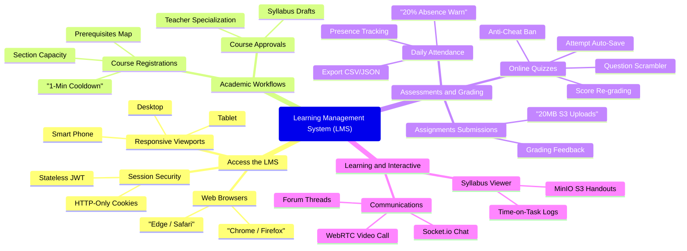

# CAPSTONE PROJECT REPORT
## Report 1 – Project Introduction

**Project Title**: Learning Management System (LMS)  
**Project Code**: LMS  
**Group Name**: SWP493-G4  
**Date**: May 26, 2026  

---

## Table of Contents
- [I. Record of Changes](#i-record-of-changes)
- [II. Project Introduction](#ii-project-introduction)
  - [1. Overview](#1-overview)
    - [1.1 Project Information](#11-project-information)
    - [1.2 Project Team](#12-project-team)
  - [2. Product Background](#2-product-background)
  - [3. Existing Systems](#3-existing-systems)
    - [3.1 Google Classroom](#31-google-classroom)
    - [3.2 Moodle (Modular Object-Oriented Dynamic Learning Environment)](#32-moodle-modular-object-oriented-dynamic-learning-environment)
    - [3.3 Canvas LMS](#33-canvas-lms)
  - [4. Business Opportunity](#4-business-opportunity)
  - [5. Software Product Vision](#5-software-product-vision)
  - [6. Project Scope & Limitations](#6-project-scope--limitations)
    - [6.1 Major Features](#61-major-features)
    - [6.2 Limitations & Exclusions](#62-limitations--exclusions)

---

## I. Record of Changes

| Date | Action* | In Charge | Change Description |
| :--- | :---: | :--- | :--- |
| 2026-05-10 | A | SWP493-G4 | Initial draft of the Project Introduction Report. |
| 2026-05-15 | A | Nghiem Thi Thuy Van | Added Product Background, Existing Systems analysis, and Business Opportunity. |
| 2026-05-20 | M | Dam Thi Huyen | Aligned Project Scope (FE-01 to FE-08) with the actual codebase features (JWT Cookies, MinIO, Socket.io). |
| 2026-05-24 | M | Dao Thi Phuong | Updated Limitations & Exclusions to reflect the 20MB file limit and WebRTC 1-to-1 signaling scopes. |
| 2026-05-26 | M | Vu Thi Thuy | Standardized formatting and verified consistency with the functional requirements documentation. |

*\*Action: A - Added, M - Modified, D - Deleted*

---

## II. Project Introduction

### 1. Overview

#### 1.1 Project Information
- **Project Name**: Learning Management System (LMS)
- **Project Code**: LMS
- **Group Name**: SWP493-G4
- **Software Type**: Responsive Web Application (ExpressJS Backend & React 19 / Vite Frontend)

#### 1.2 Project Team

| Full Name | Role | Email | Mobile |
| :--- | :--- | :--- | :--- |
| **Nguyen Trung Kien** | Lecturer / Supervisor | kiennt@fe.edu.vn | 0912656836 |
| **Nghiem Thi Thuy Van** | Group Leader | vanntt@fe.edu.vn | 0987654321 |
| **Dam Thi Huyen** | Business Analyst & Backend Dev | huyendt@fe.edu.vn | 0977123456 |
| **Dao Thi Phuong** | Frontend Developer | phuongdt@fe.edu.vn | 0966987654 |
| **Vu Thi Thuy** | Quality Assurance (QA) | thuyvt@fe.edu.vn | 0955111222 |

---

### 2. Product Background

Modern academic institutions face severe operational friction due to highly fragmented administrative procedures. Currently, student enrollments, attendance tracking, syllabus updates, exam delivery, and teacher-student messaging are split across separate manual pipelines. 

In a traditional academic setup:
1. **Attendance Tracking**: Recorded manually on paper or Excel sheets. Academic administrators must manually compute aggregate attendance percentages at the end of a term. This delayed process results in failure to timely warn students whose absence rates exceed the **20% suspension threshold**, leading to late-stage administrative disputes.
2. **Course Registrations**: Done manually without real-time validation of prerequisite subject hierarchies. Students frequently register for courses without passing prerequisite subjects, undermining classroom teaching quality.
3. **Assessment & Grading**: Handled via physical test sheets or generic email file attachments. This results in heavy physical storage costs and provides no defense against sudden network disconnections during online tests, causing complete student data loss.
4. **Communication**: Real-time discussions and make-up schedule exceptions are handled through unorganized, third-party chat platforms, causing announcements to get buried and teachers to struggle with class-wide coordination.

To resolve these operational pain points, this Capstone Project proposes a unified, real-time **Learning Management System (LMS)**. The system integrates advanced security (Stateless HTTP-Only JWT Cookie verification), cloud-native asset storage (MinIO S3), real-time notification alerts (Resend API), interactive quiz engines with automatic disconnections fallback (auto-save attempts), and low-latency audio/video classrooms (Socket.io WebSockets + WebRTC signaling).

---

### 3. Existing Systems

To design a robust, competitive LMS, the team analyzed three industry-leading existing learning management frameworks:

#### 3.1 Google Classroom
- **Description**: A free web service developed by Google for schools that aims to simplify creating, distributing, and grading assignments.
- **System Actors**: Teacher, Student, Parent.
- **Key Features**: Google Drive integration for assignments, real-time feedback, announcements bulletin.
- **Pros**: 
  - Extremely easy to navigate; highly intuitive interface.
  - Seamless, secure login utilizing existing Google Accounts.
- **Cons**:
  - Lacks strict database controls to prevent students from enrolling in advanced courses without meeting prerequisite subject requirements.
  - Very basic testing module; does not support randomized question scramblers or secure anti-cheat browser monitors.
- **Reference for LMS Design**: Inspired our simplistic dashboard flow, notifications layout, and attachment-friendly grading consoles.

#### 3.2 Moodle
- **Description**: A global, free, open-source modular learning management platform.
- **System Actors**: Administrator, Manager, Teacher, Non-editing Teacher, Student, Guest.
- **Key Features**: Complex course builders, advanced question banks, custom plugins support, activity tracking.
- **Pros**:
  - Highly customizable with rich plugins and extensive database models.
  - Comprehensive question categories and automatic grading.
- **Cons**:
  - Extremely steep learning curve; complex user interface that frustrates students and teachers.
  - High resource usage; requires heavy configuration and server tuning for real-time features.
- **Reference for LMS Design**: Guided our `Subject-Major-Specialist` database tree and the core layout of our centralized question banks.

#### 3.3 Canvas LMS
- **Description**: A modern, cloud-native commercial learning management platform widely adopted by major global universities.
- **System Actors**: Administrator, Instructor, Student, Observer.
- **Key Features**: SpeedGrader console, integrated calendars, rich analytics charts, WebRTC video integrations.
- **Pros**:
  - Clean layout with exceptional usability and responsive mobile rendering.
  - Robust analytics dashboard depicting student task performance.
- **Cons**:
  - Expensive commercial licensing, making it inaccessible for smaller colleges.
  - Complex custom LTI integrations for real-time video classrooms.
- **Reference for LMS Design**: Inspired the development of our dedicated Teacher Grading Console (Score + Markdown Feedback) and our real-time video chat portal using Socket.io signaling.

---

### 4. Business Opportunity

Developing this unified LMS presents substantial operational and business value for universities and training centers:

1. **Automated Operational Efficiency**: Administrators save hundreds of hours by automating attendance calculations. The system runs background cron tasks that automatically detect students with absence rates exceeding **20%** and immediately dispatches warning alerts (`MSG-ATT-01`) via email.
2. **Academic Integrity Protection**: Our real-time validation checks ensure that students cannot self-enroll in class sections unless they have completed and passed all prerequisite subjects (`BR-01`). Furthermore, course section creations check teachers' academic `Specialist` areas, preventing unqualified instructors from teaching advanced subjects.
3. **Data Loss Prevention**: The quiz engine implements a background auto-save mechanism (`US-074`). When students take tests, choices are synchronized back to MongoDB instantly. If a network disconnection occurs, their progress is preserved.
4. **Reduced Infrastructure Waste**: Advanced cloud integration with MinIO S3 object storage replaces expensive physical filing cabinets. Presigned URLs guarantee file access security, while a strict **20MB size boundary** on all uploads (enforced in `multer.ts`) prevents storage spamming.

---

### 5. Software Product Vision

**For** university administrators, teachers, and students who struggle with fragmented, manually coordinated learning processes, the **Learning Management System (LMS)** is an integrated, secure, and highly responsive web portal. 

**It will** unify course syllabus creation, secure self-enrollments, cloud-native file storage, countdown quiz examinations, homework grading consoles, and instant real-time chat classrooms with WebRTC video calling. 

**Unlike** traditional learning platforms (such as Moodle or manual Excel-based administration), this LMS implements stateless **Secure HTTP-Only JWT Session Cookies** to prevent security breaches, enforces a **1-minute cooldown anti-spam mechanism** for enrollments, checks teacher specializations, guarantees zero data loss via quiz auto-saves, and alerts student attendance thresholds automatically. This saves administrative costs, improves learning focus, and ensures high academic standards.

#### System Scope Mind Map
Below is the structural system scope diagram representing the core modules, access nodes, and operations of the Learning Management System (adapted from system features):

---

### 6. Project Scope & Limitations

#### 6.1 Major Features

| Feature ID | Feature Name | Description |
| :--- | :--- | :--- |
| **FE-01** | **Secure Session Authentication** | Provides secure signup and login flows for Students, Teachers, and Admins. Uses bcrypt password hashing, 6-digit email OTPs via the Resend API, and stores JWTs within stateless **Secure HTTP-Only Cookies** to neutralize XSS attacks. |
| **FE-02** | **Subject Prerequisite Map** | Enforces a strict tree structure of academic Specializations, Majors, and Subjects. Prevents students from enrolling in course sections unless they have successfully completed prerequisite subjects. |
| **FE-03** | **Syllabus & Course Draft Builder** | Allows Teachers to build course chapters, structure syllabus lessons, and upload materials. Keeps courses in `DRAFT` status until verified and published to `ONGOING` by an Admin. |
| **FE-04** | **Lesson Materials Streaming** | Uploads, manages, and streams lecture slides (PDFs), video lectures (MP4), and audios (MP3) securely via **MinIO S3 Presigned URLs**. |
| **FE-05** | **Quiz Examination Engine** | Randomly shuffles questions (`Question Scrambler`) from the shared pool. Conducts tests with active timers, implementing background **Auto-Save** answers, cheat-detection locks (Banned status), and manual teacher re-grading controls. |
| **FE-06** | **Essay Submissions & Grading** | Allows students to upload homework documents (max **20MB** limit) and enables teachers to assign scores (0-10) and write descriptive markdown review feedback. |
| **FE-07** | **Timetables & Roster Attendance** | Administers weekly timetables, shifts, and make-up schedule exceptions. Provides daily attendance rosters for teachers, backed by a cron system that sends automated email alerts when student absences reach **20%**. |
| **FE-08** | **Live Chat & Video Calling** | Utilizes **Socket.io** to establish persistent, bidirectional WebSocket channels for instant messaging, group chat rooms, and WebRTC peer-to-peer classroom video calling. |

#### 6.2 Limitations & Exclusions

1. **Exclusively Web-Based Client (LI-1)**: The client application is designed and optimized purely as a responsive web application (React 19 / Vite). Native desktop applications (e.g., Windows .exe, macOS .app) and mobile store applications (iOS IPA, Android APK) are out of scope for Release 1.0.
2. **File Upload Size Constraints (LI-2)**: To prevent storage exhausting attacks on the MinIO S3 cluster, the backend enforces a hard **20MB size ceiling** per file across all uploading channels (enforced in `multer.ts`). Tweak request options to upload files larger than 20MB will be rejected with an immediate 400 error.
3. **1-to-1 WebRTC Video Signaling Limit (LI-3)**: Real-time video calling runs on direct Peer-to-Peer WebRTC signaling routed via Socket.io. Multi-peer group video classrooms with MCU (Multipoint Control Unit) or SFU (Selective Forwarding Unit) media servers are excluded from the scope of Release 1.0; group calling is restricted to text communication.
4. **Single-Campus Scope (LI-4)**: Roster timetables and attendance calculations do not integrate cross-campus synchronization; schedules operate strictly within a single university campus system boundary.
