# LMS System Use Case Diagrams

This document contains visual Use Case Diagrams for each of the 11 functional modules of the **Learning Management System (LMS)**. The diagrams are generated using **Mermaid UML standard syntax** and mapped directly to the actual user stories, actor roles, API backend routes, and external systems in your codebase.

Each diagram explicitly highlights:
- **`<<include>>`** and **`<<extend>>`** relationships between use cases.
- **External Systems** (such as the Email System, S3 storage, and WebSockets gateway) as secondary actors on the right side of the diagrams.

---

## 👥 System Actors Directory

### Primary Actors (Left Side)
1. **👤 Student**: Enrolled learners who access lessons, submit assignments, take quizzes, discuss in forums, chat in real-time, and view grades.
2. **👤 Teacher**: Educators who build courses, publish lessons, upload lecture resources, manage weekly schedules, grade submissions, run exams, and moderate attendance.
3. **👤 Admin**: System administrators managing campus catalogs, approving teachers' courses, setting up subject prerequisites maps, auditing user accounts, and moderating feedbacks.
4. **⚙️ System Cron**: Autonomous automated daemons running background jobs, such as calculating thresholds and triggering attendance warning events.

### Secondary External Actors (Right Side)
1. **✉️ External Email System** *(Resend Mail API)*: Handles automated email transmissions (OTP activations, password resets, absence threshold warnings).
2. **💾 S3 Cloud Storage** *(MinIO Storage)*: Manages unstructured binaries (pdfs, video lectures, homework files, and review attachment uploads).
3. **⚡ WebSocket Gateway** *(Socket.io Gateway)*: Coordinates low-latency real-time bidirectional events (instant messaging seen-states, video calls signaling).

---

## 🗂️ Module Use Case Diagrams

### 1. Authentication & Account Management
Covers user registration, email activations, login sessions (JWT/Cookies), profile dashboards, and administrative user controls.

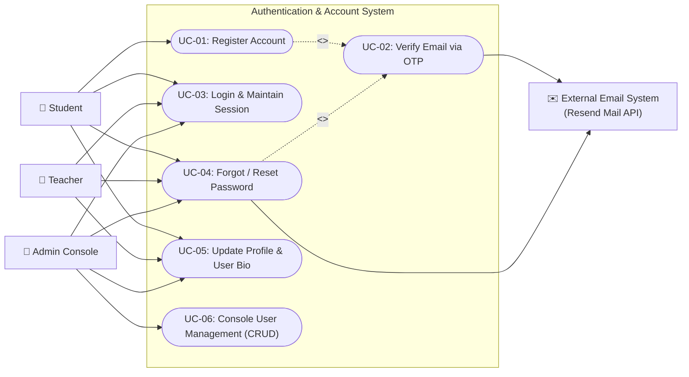

---

### 2. Course & Class Section Management
Enables syllabus definitions, course curation, administrative specialty validation checks, and splitting enrollments into parallel subsections.

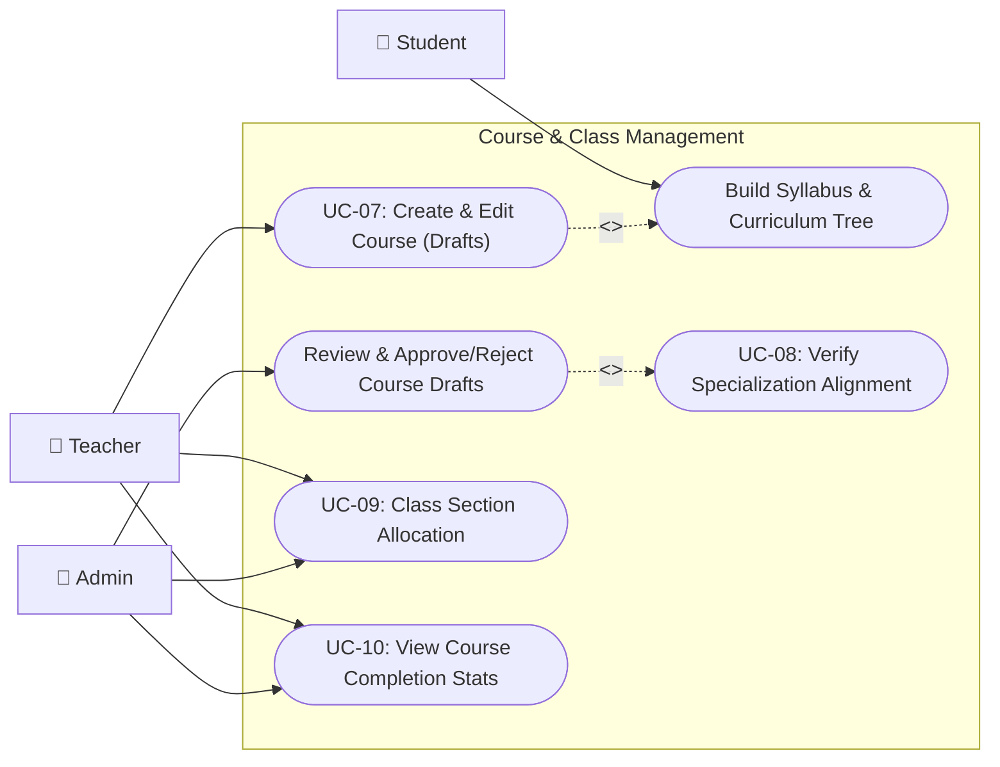

---

### 3. Enrollment & Course Invites
Coordinates student self-enrollments governed by cooldowns and capacity checks, as well as sharing secure, expiring invite links.

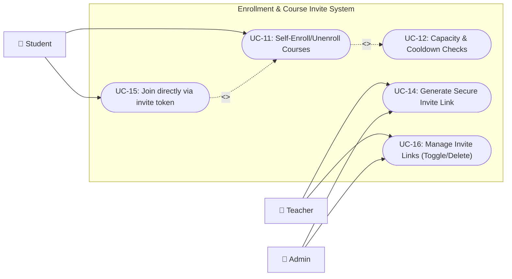

---

### 4. Subjects & Prerequisites map
Manages the university's academic subject index, automated text searches, slug building, and mapping prerequisite check routes.

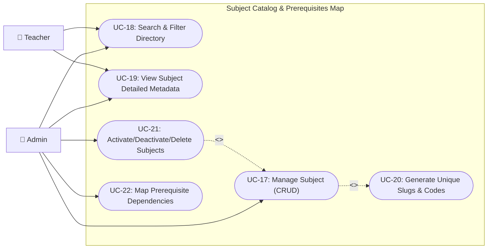

---

### 5. Lessons & Learning Progress
Coordinates lecture curriculums, uploading educational documents directly to MinIO S3, tracking study times, and reporting lesson completion states.

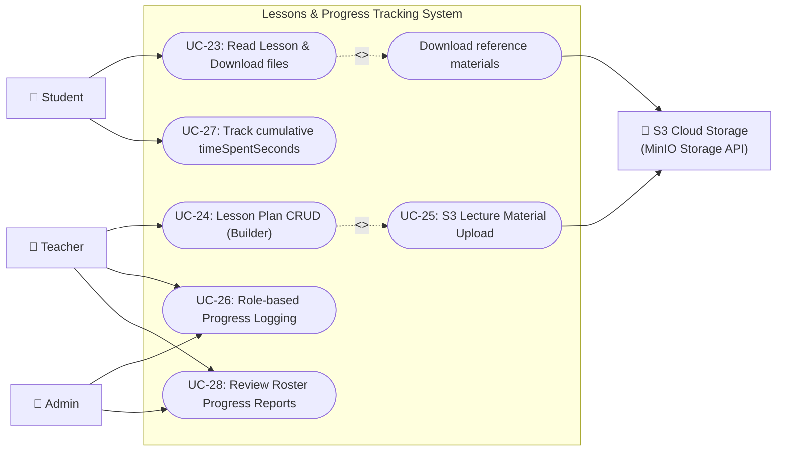

---

### 6. Quiz & Questions Bank
Facilitates importing/exporting questions in XML, mixing randomized questions, auto-saving exam answers, ban overrides, and grading monitors.

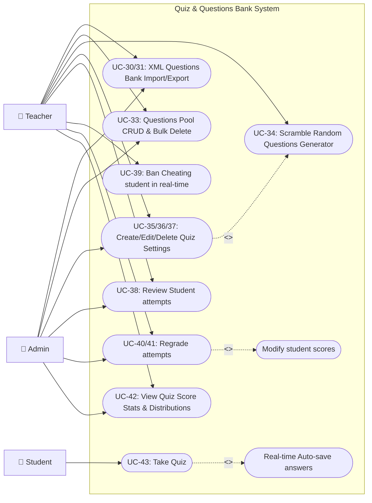

---

### 7. Assignments & Submissions Grading
Manages assignment postings, student homework uploads to MinIO S3, essay grading feedback, transcripts, and final grading reports.

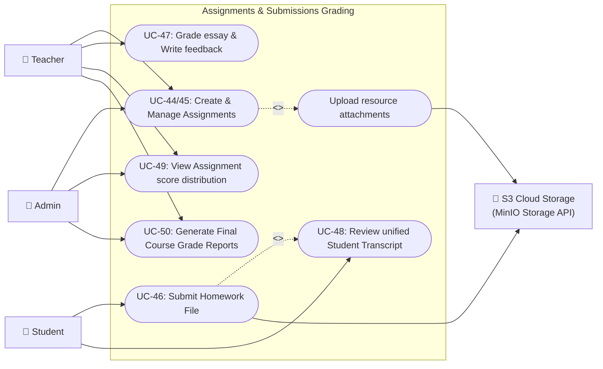

---

### 8. Attendance & Schedules
Coordinates room slots planning, classroom roster call logs, locking late updates, CSV exports, and automated absence warnings.

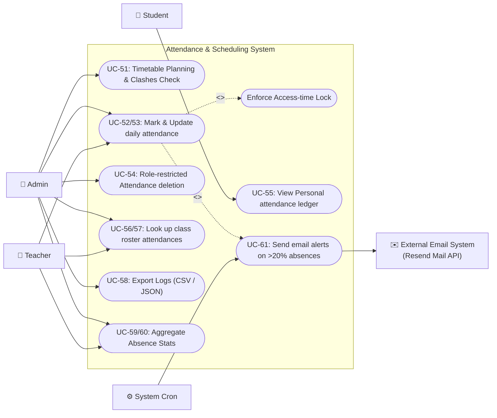

---

### 9. Forums, Blogs & Live Chat
Fosters social learning through discussion boards, instant messages, and WebSockets-based video calls.

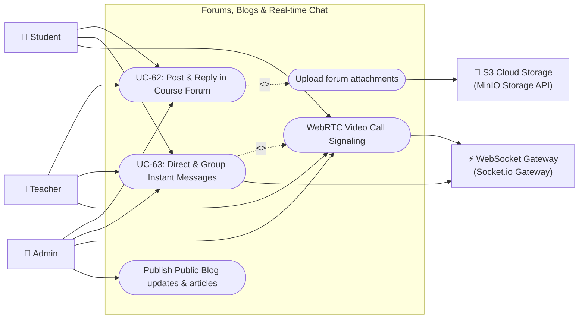

---

### 10. Feedback System
Tracks anonymous course evaluations and teacher performance ratings, auditing reviews, and compiling averages.

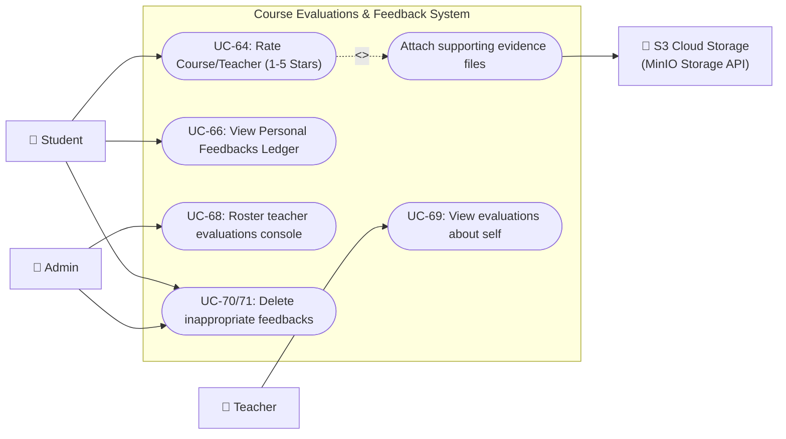

---

### 11. Announcements & Notifications
Ensures prompt broadcasts of news, course changes, and grades via notifications and bulletin boards.

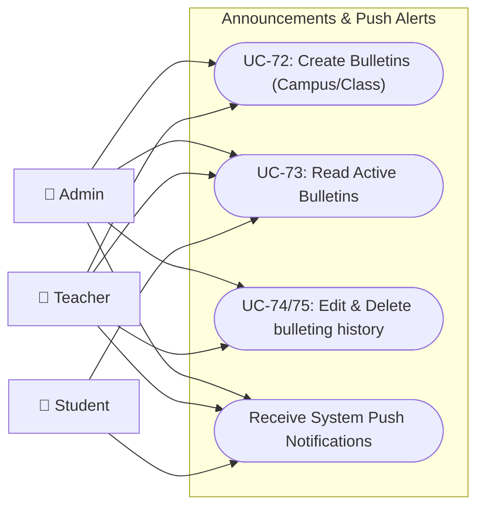
